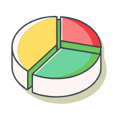

# Monthly Control
 
<p align="center">
    
</p>

Welcome to the **Monthly Control**! \
This project is designed to help you manage your monthly income and expenses.

It is a local first application, using IndexedDB for storage. \

For server sync purposes, you'll need something like:
- [monthly-control-api](https://github.com/rafaLino/monthly-control-api)
- [params-api](https://github.com/rafaLino/params-api)

## Table of Contents

- [Getting Started](#getting-started)
- [Running the app](#running-the-app)
- [Dependencies](#dependencies)
- [Reminders](#reminders)
- [License](#license)


## Getting Started

To get started with the Monthly Control project

#### Insert it into your `.npmrc` to add the new registry:

```
@rafael-lino=https://npm.pkg.github.com
//npm.pkg.github.com/:_authToken=GITHUB_TOKEN
```
It's needed for [Quick calculator](https://github.com/rafael-lino/react-quick-calculator)

 #### Clone the repository and install the dependencies:

```bash
git clone https://github.com/rafaLino/monthly-control
cd monthly-control
pnpm install
```


### Test with playwright

Install the dependencies: 

```bash
pnpm exec playwright install --with-deps
```

And run:

```bash
pnpm run test
```

## Running The App
To run the project, use:

```bash
docker compose up -d
```

This will start the container, and you can view it at `http://localhost:5000`.


## Dependencies

- TanStack [Router](https://tanstack.com/router/latest), [Table](https://tanstack.com/table/latest) and [Query](https://tanstack.com/query/latest)
- State management using [Zustand](https://zustand-demo.pmnd.rs/)
- Storage with [idb](https://github.com/jakearchibald/idb)
- Responsive UI using [shadcn](https://ui.shadcn.com/)
- Style with [Tailwindcss](https://tailwindcss.com/)
- Date handling with [date-fns](https://date-fns.org/docs/Getting-Started)
- Internationalization with [react-i18next](https://react.i18next.com/)

Refer to the `package.json` file for more details on specific versions.

# Reminders
Create a new branch and do your changes. \

After finishing, commit and tag it! 

```bash
npm version [major|minor|patch]
```

```bash
git push --follow-tags
```

Use the tags to make a release.

## License

This project is licensed under the [MIT License](LICENSE).

